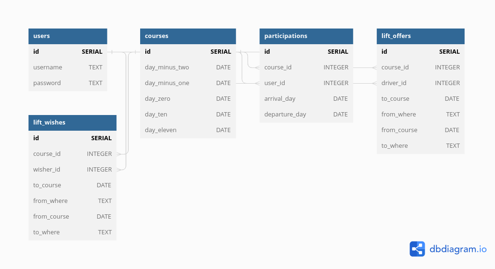

# Signup application for course setup and teardown

In order to organise 10 day residential courses, volunteers are needed at rented course sites for setup (starting two days before coures start) and teardown (during last two days of course). This page enables people to sign up for these activities, and admins to see who signed for what time.

## User roles

### Admin
Admins can add and modify course data
### Basic user
Basic users can sign up for course setup and teardown and modify their own signup information

## Existing pages

### Courses page

- displays list of courses to sign up to
- by clicking a course, a Course information & signup page for that course opens

### Course signup page (for each course)
- contains options to sign up for setup or teardown for this specific course and modify this information
- Input fields:
    - time of arrival, days spent and time of leaving

### Information page (for each course)
- shows course dates and setup and teardown dates

### Login page
- Login to access all other functionality

### Register page
- Register to be a basic user, get rights to login

### Lift offer page
- Offer lift for the dates you signed up for

### Lift wish page
- Wish lift for the dates you signed up for

## Run application locally

Clone this repository. Go to the local project repository's root folder `signup-app`. Create `.env` file in root folder. Add following contents to `.env`:

    DATABASE_URL=postgresql+psycopg2:///<your-username>
    SECRET_KEY=<secret-key-you-made-up>

Create virtual environment and activate it:

    $ python3 -m venv venv
    $ source venv/bin/activate

Install requirements:

    $ pip install -r ./requirements.txt

Start database in separate terminal window:

    $ start-pg.sh

Define database schema:

    $ psql < schema.sql

Run application locally

    $ flask run

## Test application

Register to be a user.

Two courses have been added to database. You can sign up for them and view your signup info. You can also offer or request lifts for the days you signed up for.

At the moment modifying signup or lift info is not yet possible. Also viewing lift info is not possible yet.

## Database diagram 19.2.23: five tables

