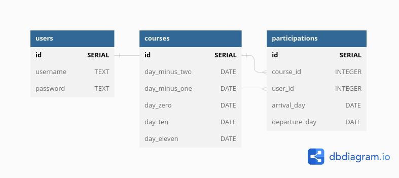
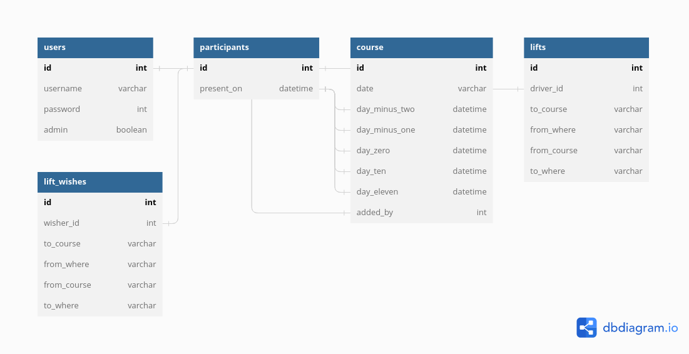

# Signup application for course setup and teardown

In order to organise 10 day residential courses, volunteers are needed at rented course sites for setup and teardown. This webapp enables people to sign up for these activities, and admins to see who signed for what time.

## User roles

### Admin
Admins can add and modify course data
### Basic user
Basic users can sign up for course setup and teardown and modify their own signup information

## Existing pages

### Courses page

- displays list of courses to sign up to
- by clicking a course, a Course information & signup page for that course opens

### Course signup page (for each course)
- contains options to sign up for setup or teardown for this specific course and modify this information
- Input fields:
    - time of arrival, days spent and time of leaving
    - name and contact information
    - car or no car
    - if car, what time arrives and leaves and from where and where to
    - if no car, does wish lift or not, if yes, from where and where to
    - simple version will be added before 5.2.: days spent and nothing else
    - before 19.2.: everything else

### Information page (for each course)
- shows how many people have signed up and for what times
- shows user's own signup information for this course
- Admins only: shows names of people that signed up
- will be added before 5.2., except Admin parts before 19.2.

### Login page
- After login basic user can view and modify one's signup information
- After login admin can modify course information and view names and contact information of people who signed up
- Only very simple login page for basic user added before 5.2.

## Pages to be added later

### Register page
- Register to be a basic user, get rights to login
- will be added before 19.2.

### Add course page
- Admin only! 
- Add new course
- will be added before 19.2.

### Register admin page
- Register to be admin, get admin rights
- Will be added only if enough time

## Run application locally

Clone this repository. Go to the local project repository's root folder `signup-app`. Create `.env` file in root folder. Add following contents to `.env`:

    DATABASE_URL=postgresql+psycopg2:///<your-username>
    SECRET_KEY=<secret-key-you-made-up>

Create virtual environment and activate it:

    $ python3 -m venv venv
    $ source venv/bin/activate

Install requirements:

    $ pip install -r ./requirements.txt

Start database in separate terminal window:

    $ start-pg.sh

Define database schema:

    $ psql < schema.sql

Run application locally

    $ flask run

## Test application

Log in using credentials:

    username: testuser

At the moment, password is not necessary. It will be needed only later on.

Two courses have been added to database. You can sign up for them and view your signup info.

At the moment it's possible  for one user to sign up for same course many times. That possibility will be removed in the future.

## Database diagram 5.2.23: three tables

## Database diagram 19.2.23: five tables

